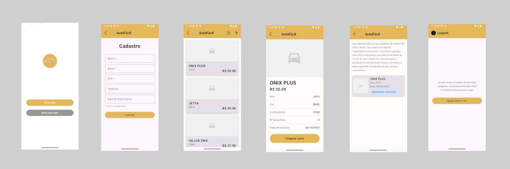

<p align="center">
  
</p>

<p align="center">
  
  
  
  
  
  
  
  
  
  
  
</p>

---

# AutoFácil - App de Portfólio

**AutoFácil** é um aplicativo Android desenvolvido como portfólio, com o objetivo de simular uma plataforma de compra de carros. O app permite que usuários naveguem por uma lista de veículos disponíveis, visualizem detalhes, realizem pedidos de compra (leads) e acompanhem o status desses pedidos, tudo com uma arquitetura moderna, robusta e escalável.

---

## ✨ Demonstração

<p align="center">
  
</p>

---

## 🚗 Sobre o Projeto

O aplicativo foi desenvolvido totalmente em **Kotlin**, utilizando **Jetpack Compose** para a interface, seguindo o padrão **Clean Architecture** e o modelo **MVVM**. O objetivo é demonstrar boas práticas de arquitetura, testes, persistência local, consumo de APIs e automação de deploy.

### Principais Funcionalidades

- **Navegação fluida** entre telas com Jetpack Compose Navigation.
- **Listagem de carros** disponíveis para venda, consumindo dados de uma API via Retrofit.
- **Visualização de detalhes** de cada carro.
- **Cadastro e login** de usuários (persistência local com Room).
- **Criação de pedidos de compra (Leads)**, salvos localmente e sincronizados com a API.
- **Sincronização automática** de Leads não enviadas a cada 1h usando WorkManager.
- **Gerenciamento de autenticação**: visualizar carros sem login, mas exige login para criar Leads.
- **Listagem de Leads** com status de sincronização.
- **Logout** com deleção de todos os dados locais.
- **Testes unitários** cobrindo todas as camadas.
- **Deploy automatizado** via GitHub Actions.

---

## 🏗️ Arquitetura e Tecnologias

- **MVVM (Model-View-ViewModel)**: separação clara de responsabilidades.
- **Clean Architecture**: domínio isolado, camadas de dados, apresentação e infraestrutura bem definidas.
- **Room**: persistência local dos dados (User, Lead).
- **Retrofit**: consumo de APIs REST para carros e sincronização de Leads.
- **Repository & UseCase Pattern**: abstração de regras de negócio e acesso a dados.
- **Mappers**: conversão entre DTOs, entidades de banco e modelos de domínio.
- **Koin**: injeção de dependências simples e eficiente.
- **WorkManager**: agendamento de tarefas em background para sincronização de Leads.
- **Jetpack Compose**: construção declarativa e moderna da interface.
- **Testes Unitários**: cobertura total das regras de negócio e camadas de dados.
- **GitHub Actions**: CI/CD para build, testes e deploy automatizado.

---

## 🖼️ Fluxo de Telas

<p align="center">
  
</p>

---

## 📱 Telas do Aplicativo

### 1. **Home**
Tela inicial com opções de cadastro ou de entrar sem login. Permite ao usuário navegar livremente pela lista de carros, mas restringe ações de compra a usuários autenticados.

### 2. **Cadastro**
Tela para coleta de informações do usuário (nome, email, etc.), salvando os dados localmente na tabela User do Room.

### 3. **Lista de Carros**
Exibe todos os carros disponíveis para venda, consumidos da API. Ao selecionar um carro, o usuário é direcionado para a tela de detalhes. A toolbar exibe:
- Se logado: botões para acessar Leads e Logout.
- Se não logado: botão para fazer login.

### 4. **Detalhes do Carro**
Mostra informações detalhadas do carro selecionado. Possui botão para "Comprar Carro", que cria um Lead no banco local (se logado) ou exibe mensagem solicitando login.

### 5. **Leads**
Lista todos os pedidos de compra (Leads) já criados, mostrando o status:
- **Aguardando Sincronizar**: aguardando rotina automática (WorkManager) que sincroniza a cada 1h.
- **Sincronizado**: Lead já enviada para a API, aguardando contato do vendedor.

### 6. **Logout**
Tela com botão para deletar todos os dados do banco de dados local e redirecionar para a Home.

---

## ⚙️ Detalhes Técnicos

- **Persistência de Leads**: Leads são salvas no SQLite via Room. A cada 1h, o WorkManager busca Leads não sincronizadas e envia para a API.
- **Autenticação**: Usuário pode navegar sem login, mas precisa estar autenticado para criar Leads.
- **Mappers**: Conversão entre entidades do banco, DTOs da API e modelos de domínio para garantir isolamento de camadas.
- **Injeção de Dependências**: Koin gerencia todos os repositórios, usecases e viewmodels.
- **Testes**: Todos os casos de uso, repositórios e mapeamentos possuem testes unitários.
- **CI/CD**: Pipeline automatizado com GitHub Actions para build, testes e deploy.

---

## 🚀 Como rodar o projeto

1. Clone o repositório:
   ```bash
   git clone https://github.com/caduviegas/CarsList.git
   ```
2. Abra no Android Studio (recomendado Arctic Fox ou superior).
3. Configure um emulador ou dispositivo físico com Android 12+.
4. Rode o projeto normalmente.

---

## 📄 Licença
Este projeto está sob a licença MIT. Veja o arquivo LICENSE para mais detalhes.

---

Dúvidas, sugestões ou feedback?
Fique à vontade para abrir uma issue ou enviar um pull request!